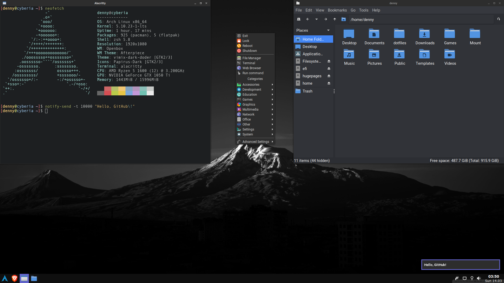

# dotfiles

Install the following packages with your favorite AUR helper: <br>
```
stow dunst obmenu-generator openbox picom rofi tint2 feh network-manager-applet polkit-dumb-agent-git volctl
numlockx redshift xcape opensnap gtk2-perl alacritty pcmanfm ttf-roboto lxappearance papirus-icon-theme
qt5-styleplugins vimix-gtk-themes file-roller p7zip unrar brave-bin xdotool i3lock-fancy-git neofetch
noto-fonts-emoji noto-fonts-cjk obconf zsh-syntax-highlighting zsh-autosuggestions
```

Download the openbox theme and install it with ```obconf```: <br>
https://www.gnome-look.org/p/1017696/

Download the cursor theme and put it in ```~/.icons```: <br>
https://www.gnome-look.org/p/999927/

Put this in ```/etc/environment```: <br>
```
XDG_CURRENT_DESKTOP=Unity 
QT_QPA_PLATFORMTHEME=gtk2
```

And then inside the ```dotfiles``` directory remove the ```README.md``` and ```screenshot.png``` files and run: <br> (you will probably need to remove ```~/.bashrc``` and any other already existing files) <br>
```
stow -t ~ *
```

And configure the GTK themes in ```lxappearance```.



zsh configuration:
```
touch "$HOME/.cache/zshhistory"
git clone --depth=1 https://github.com/romkatv/powerlevel10k.git ~/powerlevel10k
chsh $USER
```
