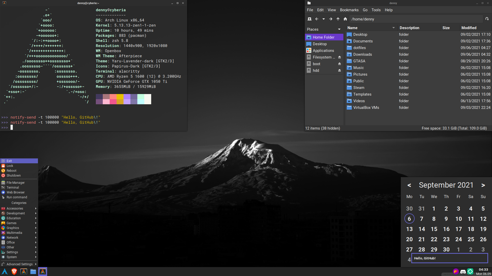

# dotfiles

A pretty much desktop environment made with openbox and other minimal(-ish) tools



Install the following packages with your favorite AUR helper to get the basic desktop setup:
```
stow dunst obmenu-generator openbox picom xcape tint2 feh network-manager-applet polkit-gnome volctl alsa-utils
vimix-gtk-themes xdotool i3lock-color flameshot numlockx redshift ttf-roboto lxappearance opensnap galendae-git
gtk2-perl lxappearance-obconf gnome-keyring papirus-icon-theme ttf-roboto-mono ttf-roboto-slab
```

You will probably also want to install a terminal emulator, web browser, file explorer and a run launcher.

Download the openbox theme and install it with ```lxappearance```: <br>
https://www.gnome-look.org/p/1017696/

Download the cursor theme and extract it in ```~/.icons```: <br>
https://www.gnome-look.org/p/999927/

Then remove ```README.md```, ```screenshot.png```, ```.gitignore```, already existing files and inside the dotfiles directory run:
```
stow -t ~ openbox tint2 dunst ...
```
Or if you just want to use all my dotfiles run:
```
stow -t ~ *
```

And set the GTK themes in ```lxappearance```. **(set hinting style to slight and antialiasing to on if you stowed fonts)**

Also change "alacritty" in openbox/rc.xml and obmenu-generator/config.pl if you want to use another terminal. <br>

You can also change "rofi" in the above mentioned files if you use dmenu or any other run launcher. <br>

Some things in openbox/rc.xml are hardcoded for 1080p, but you can easily adapt them for your resolution.

You might also want to check out my other repo [other-configs](https://github.com/deennyy/other-configs/).

# zsh setup:
Install ```zsh``` and ```zsh-syntax-highlighting``` and then run:
```
touch "$HOME/.cache/zshhistory"
chsh $USER
```

# Mount scripts:
If you want to use the rofimount/rofiunmount scripts install ```rofi``` and ```seahorse``` add this to ```/etc/sudo.conf```:
```
Path askpass /usr/lib/seahorse/ssh-askpass
```
Also install ```jmtpfs``` (AUR) if you want to mount Android phones and ```dosfstools``` if you want to mount FAT drives. <br>

Full credit to [Luke Smith](https://github.com/LukeSmithxyz) for the scripts, I just adopted them to use rofi and other small changes.

# Audio:
If you stowed audio make sure you have ```pulseaudio``` and ```pulseaudio-alsa``` installed. 
